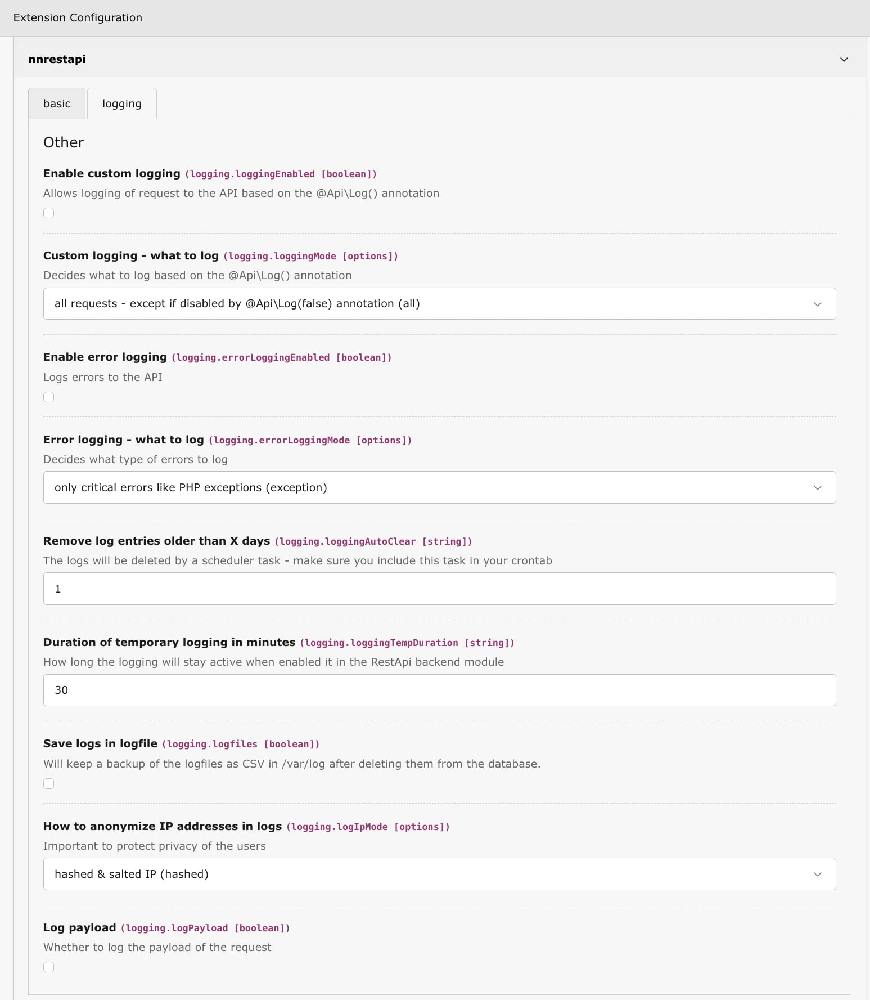

.. include:: ../Includes.txt

.. _logging:

============
Logging
============

The nnrestapi extension provides comprehensive logging capabilities to help you monitor, debug, and audit 
API requests. Logs are stored in the database table ``nnrestapi_log`` and can be backed up before they 
are deleted from the database in a CSV file in ``/var/log/`` and can be viewed in the backend module.

---------
Overview
---------

The logging system allows you to:

* **Monitor API usage**: Track all requests to your API endpoints
* **Debug issues**: Identify problems by reviewing request details, payloads, and responses
* **Audit access**: Keep records of who accessed which endpoints and when
* **Analyze performance**: Review response times and error rates

---------
Logging of requests
---------

There are two ways to activate logging of API requests:

Temporary logging (via backend module)
~~~~~~~~~~~~

In the backend module, navigate to the "Logs" tab and check "Enable logging". This will 
enable logging of all requests for a limited time (default: 30 minutes) and then disable 
it automatically. The duration can be configured in the Extension Manager under 
``loggingTempDuration``.

This is perfect for debugging and short-term monitoring of API usage.

Permanent logging (via Extension Manager)
~~~~~~~~~~~~

If you want permanently log requests, enable "Enable custom logging" in the Extension Manager.
You can then use the ``loggingMode`` setting to control which requests are logged:

* ``all``: Log all requests, except those with ``@Api\Log(false)``
* ``explicit``: Only log requests that have ``@Api\Log()`` or ``@Api\Log(true)``
* ``force``: Log all requests, ignoring any ``@Api\Log()`` annotations

---------
Auto-cleaning logs
---------

To keep the database table small and clean, you can configure automatic deletion of old log entries.

Remove log entries older than X days
~~~~~~~~~~~~

Set the number of days after which log entries should be automatically deleted. The default is 
7 days. This requires the ``nnrestapi:run`` scheduler task to be configured in your crontab.

Save logs as CSV backup
~~~~~~~~~~~~

If you need to keep a backup of the logs before they are deleted, enable "Save logs in logfile" 
in the Extension Manager. This will export the log entries as CSV files to ``/var/log/`` before 
removing them from the database. This is useful for compliance, auditing, or long-term analysis.

---------
Logging of errors
---------

To log errors without logging all requests, enable "Enable error logging" in the Extension Manager.

There are two types of errors that can be logged:

Exceptions and fatal errors
~~~~~~~~~~~~

Unexpected errors caused by PHP scripts that are caught by the extension. These include 
exceptions, fatal errors, and other critical issues that occur during request processing.

Controlled API errors
~~~~~~~~~~~~

Errors thrown intentionally using the ``\nn\rest::ApiError()`` helper. These are used to 
return meaningful error responses to the client. See :ref:`Error Responses <responses_errors>` 
for details on how to use this helper.

The Extension Manager setting "Error logging - what to log" allows you to select which type 
of errors should be logged:

* ``all``: Log all errors
* ``exception``: Only log critical errors like PHP exceptions
* ``api``: Only log errors called by ``\nn\rest::ApiError()``

---------
Privacy concerns (GDPR/DSGVO)
---------

.. important::

   **IP address anonymization:**
   By default, IP addresses are anonymized before being stored in the logs. This means an IP like 
   ``12.345.67.89`` will be shortened to ``12.345.0.0``. While this is generally considered compliant 
   with GDPR/DSGVO regulations, you may want to disable IP logging entirely by setting 
   "How to anonymize IP addresses" to ``none``.

   **Payload logging:**
   By default, the request payload (POST body) is logged for debugging purposes. In production 
   environments, you should consider disabling this by unchecking "Log payload" to prevent 
   sensitive user data from being stored in the logs.

---------
Enabling logging
---------

Logging can be enabled globally in the Extension Manager under the "logging" tab:

   Logging configuration in the Extension Manager

The following settings are available:

**Enable custom logging**
   Enables or disables logging globally. When disabled, no requests will be logged 
   (unless error logging is enabled separately).

**Custom logging - what to log**
   Controls which requests are logged based on the ``@Api\Log()`` annotation:

   * ``all``: Log all requests, except those with ``@Api\Log(false)``
   * ``explicit``: Only log requests that have ``@Api\Log()`` or ``@Api\Log(true)``
   * ``force``: Log all requests, ignoring any ``@Api\Log()`` annotations

**Enable error logging**
   When enabled, errors and exceptions will be logged separately.

**Error logging - what to log**
   Controls which types of errors are logged:

   * ``all``: Log all errors
   * ``exception``: Only log critical errors like PHP exceptions
   * ``api``: Only log errors called by ``\nn\rest::ApiError()``

**Remove log entries older than X days**
   Automatically removes old log entries. Requires the scheduler task to be configured.

**Duration of temporary logging in minutes**
   How long logging stays active when enabled via the backend module toggle.

**Save logs in logfile**
   When enabled, logs are saved as CSV files in ``/var/log/`` before being deleted from the database.

**How to anonymize IP addresses**
   Controls how IP addresses are stored in logs:

   * ``none``: Do not save IP addresses
   * ``anonymized``: Save anonymized IP (last octets removed)
   * ``hashed``: Save hashed & salted IP (for grouping without revealing actual IP)
   * ``ip``: Save full IP address

**Log payload**
   Whether to log the request payload (body content).

---------
Per-endpoint logging
---------

You can control logging on a per-endpoint basis using the ``@Api\Log()`` annotation.
See :ref:`@Api\\Log annotation <annotations_log>` for details.

---------
Viewing logs
---------

Logs can be viewed in the TYPO3 backend module. The module provides:

* Filterable list of all logged requests
* Details view for each request including headers, payload, and response
* Export functionality for further analysis
* Quick actions to clear logs

---------
Scheduler task
---------

To automatically clear old log entries, add the ``nnrestapi:run`` command to your scheduler.
This command will:

* Remove log entries older than the configured number of days
* Optionally save logs to CSV files before deletion (if "Save logs in logfile" is enabled)

